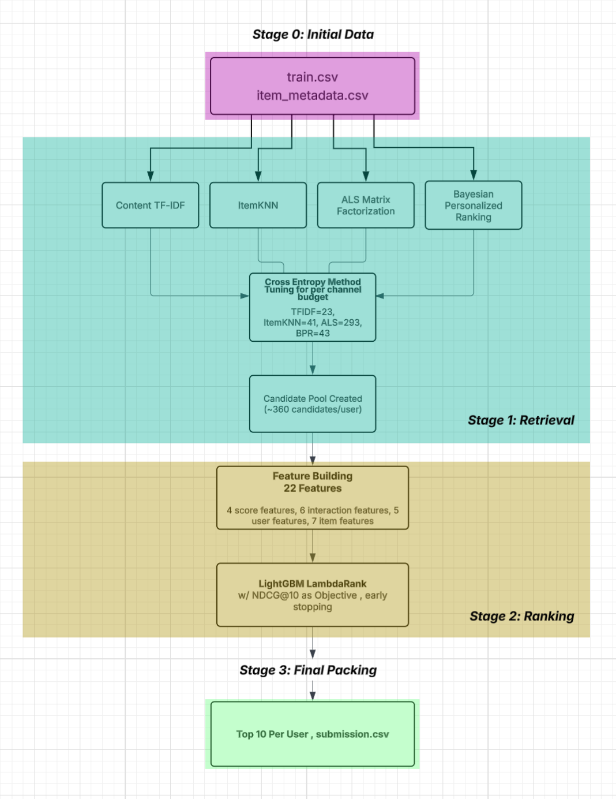

# Multi-Stage Steam Game Recommender 
**Author:** Ruhani Rekhi\
**Main Model Notebook:** `multi_stage_recsys.ipynb`\
*One Line Run*: `jupyter nbconvert --execute --to notebook --inplace multi_stage_recsys.ipynb`
\
**Data Exploration:** `data_exploration.ipynb`

## Approach Overview
This is a two-stage recommendation system that aims to predict the top-10 games each test user will play next from a catalog of around 30,000 Steam games. The pipeline first retrieves approximately 360 candidates for each user from a four-channel fusion (TF-IDF + ItemKNN + ALS Matrix Factorization + Bayesian Personalized Ranking), then ranks them with a LightGBM LambdaRank model trained on 22 features. We got a mean score ((Recall@10 + NDCG@10)/2) of 0.1034 60 times better than the random baseline of 0.0017. Below is an overview of our pipeline architecture. We will go over the two stages and implementation details in this report as well as feature engineering and cold user/cold item handling.

## Data Exploration and Validation Set 

### Data Exploration & Feature Justifications
We are given three datasets `train.csv`, `item_metadata.csv`, and the `test_users.csv`. Where `train.csv` holds our 122,366 user-item interactions which gives us the user_id and item_id pairs of each user and the items that they have reviewed as well as the playtime of the item that they have reviewed and the unix timestamp of when that review was made. The `item_metadata.csv` holds descriptive information for each of our 32,132 item catalog. Lastly we have our `test_users.csv` which is the 10,000 test user's ids that we have to populate with the predicted top-10 next games they will play.\
\
We first start the project with initial data exploration to fully understand the data we are working with to make more informed decisions when creating our recommender system...\

#### Dataset Sparsity 

|  |  |
|---|---|
| Users | 10,000 |
| Items (in train) | 8,036 |
| Train interactions | 122,366 |
| Full catalog (metadata) | 32,132 |
| Possible cells| 80,360,000 |
| Density of user–item matrix | 0.152% |
| Sparsity | 99.85% |

A big issue with this dataset is the dataset's sparsity which is especially apparent in the user-item utility matrix which upon our analysis shows it being 99.85% sparse. This discovery in itself tells us that pure collaborative filtering would be ineffective and some hybrid approach involving content based features is needed. This is why TF-IDF is essential to our retrieval approach!

#### User Activity Distribution

<table border="1" class="dataframe">
  <thead>
    <tr style="text-align: right;">
      <th></th>
      <th>interaction_counts</th>
    </tr>
  </thead>
  <tbody>
    <tr>
      <th>count</th>
      <td>10000.000000</td>
    </tr>
    <tr>
      <th>mean</th>
      <td>12.236600</td>
    </tr>
    <tr>
      <th>std</th>
      <td>18.503185</td>
    </tr>
    <tr>
      <th>min</th>
      <td>3.000000</td>
    </tr>
    <tr>
      <th>25%</th>
      <td>4.000000</td>
    </tr>
    <tr>
      <th>50%</th>
      <td>7.000000</td>
    </tr>
    <tr>
      <th>75%</th>
      <td>13.000000</td>
    </tr>
    <tr>
      <th>max</th>
      <td>536.000000</td>
    </tr>
  </tbody>
</table>

Once again we see that the distribution is heavy tailed where almost half the users have around seven interactions but there is a handful that have hundreds of interactions. This also has an implication on our modelling approach. We are using `user_history_size` as a ranker feature in the LightGBM model, this heavy tail distribution makes it so that our model learns to weigh content signals more heavily when a user's interaction history is short and lean on collaborative filtering signals more when the user's history is denser. Additionally, the minimum of 3 interactions tells us that there are no cold users.

#### Item Popularity

<table border="1" class="dataframe">
  <thead>
    <tr style="text-align: right;">
      <th></th>
      <th>item_count</th>
    </tr>
  </thead>
  <tbody>
    <tr>
      <th>count</th>
      <td>8036.000000</td>
    </tr>
    <tr>
      <th>mean</th>
      <td>15.227227</td>
    </tr>
    <tr>
      <th>std</th>
      <td>39.782772</td>
    </tr>
    <tr>
      <th>min</th>
      <td>1.000000</td>
    </tr>
    <tr>
      <th>25%</th>
      <td>1.000000</td>
    </tr>
    <tr>
      <th>50%</th>
      <td>4.000000</td>
    </tr>
    <tr>
      <th>75%</th>
      <td>11.000000</td>
    </tr>
    <tr>
      <th>max</th>
      <td>941.000000</td>
    </tr>
  </tbody>
</table>

\
We also look at item popularity within the user-item interaction data by grouping by item IDs, and using the count aggregate to get how many times each item shows up in the interaction set. Through this we also see that there is another heavy tailed distribution where approximately 1/4 of the items that have interactions in our train dataset has only one interaction. This has an implication on our `item_popularity` feature for our ranker where we apply a log1p transformation before feeding it into the model!

#### Playtime Distribution 

The data card already mentioned the wild skewing of the playtime which is further amplified when visualizing the data. Any feature that was derived from the playtime data (`user_total_playtime`, `user_mean_playtime`, `item_mean_playtime`, ALS Matrix Factorization confidence weights) was log1p transformed to counteract this heavy tail!

### Temporal Coverage 

The interactions in the data set span 2010-10-16 to 2018-01-05 which is around 7 years. An interesting thing noted upon conversion of the unix timestamps to standard datetime notation is that there are a lot of users who have multiple same-day review timestamps. When building the last 5 holdout split we break these ties with item_id rather than timestamp. The timestamp column is used to construct the `user_days_active` feature (`s.max() - s.min()).days + 1`),which subtracts the earliest date a user has reviewed from the latest date and extract the days from that timedelta and adds one to account for users who only have reviews that exist on one day. This feature allows us to get perspective on how many days has a user been active and reviewing on the platform!

### Item Metadata Coverage

| Field | Distinct values | Mean per item | Top value |
|---|---|---|---|
| Tags | 339 | 5 | Indie (54.8%) |
| Genres | 22 | 2 | Indie (49.4%) |
| Specs | 40 | 4 | Single-player (85.8%) |
| Developers | 10,988 | - | Ubisoft - San Francisco (1,259 titles) |
| Publishers | 8,233 | - | Ubisoft (385 titles) |
| Release year | - | - | 2,216 items missing (`-1`) |
| Sentiment | 19 categories | - | 7,181 missing |

This part of the data exploration also gives us insight into more decisions made later down the line.\
For TF-IDF our corpus for each item is created by combining tags, genres, and specs. Although tags have 339 distinct tags over half of the items just come under the Indie tag and a lot are categorized under the Action tag as well so we add the genres (which kind of has the same situation) and specs to get more information out of the text we have.\
We also learn that there are 2216 items with no release year recorded (has a -1 fill in) we take this into account and don't want our model to treat -1 as a real year. We create a binary flag `item_release_year_missing` to isolate these items where release year is missing.\
We also have sentiments given for each item however a majority of these sentiments are missing but for those that do exist we use ordinal encoding for our feature `item_sentiment_score` from -4 (Very Negative )to +4 (Very Positive) and missing sentiments are handled by just giving the mixed sentiment (0) which is the most common outside of the missing sentiments. I tried utilizing a missing sentiment feature similar to how we handled missing release years for this but this flag feature decreased performance and held 0 importance.\
Lastly we have the developer and publisher matching features, `score_dev_match` and `score_pub_match`. These are binary flags that tell us if the candidate item's developer appears in the user's play history 1 for yes and 0 for no. The same concept applies for the publisher.  

### Validation Split
For the validation split we are just holding out the last 5 interactions per each user by timestamp and handling timestamp ties by using item_ids as tie breaks. But since some users have fewer than 6 interactions we use clipping to make sure every user still has one training row. 

## Stage 1: Retrieval

We are using Multi-Channel Fusion with Cross-Entropy Method to get optimized weights for our 4 retrieval channels. This method is taken from the paper **Unleashing the Potential of Multi-Channel Fusion in Retrieval for Personalized Recommendations** by Huang et al.

| Channel | Method | Config |
|---|---|---|
| **TF-IDF** | Cosine similarity between user-profile vector and item vectors over tags, genres, and specs| `min_df=5, max_df=0.5, sublinear_tf=True, l2-norm` |
| **ItemKNN** | Item–item cosine on user-item matrix; user score is the sum of similarities to history items weighted by `log1p(playtime)` | - |
| **ALS-MF**[^1] | Matrix Factorization on (user, item) with confidence `1 + alpha·log1p(playtime)` | 64 factors, 15 iters, reg=0.05, α=5.0 |
| **BPR**[^2] | Pairwise Bayesian Personalized Ranking | 64 factors, 100 iters, lr=0.01, 20 negatives/positive |
(More intuition on ALS-MF and BPR in notebook! also a footnote in this file)

As of now we have four outlined retrieval channels, and each one given a user can give us a ranked list of hundreds of candidate items that we can use. But our later ranker can only rank on a certain number of candidates, this is the pool that we want to rank out of. So we want to know in the total slots that we have for each user's retrieved pool how many slots in this pool should each of the 4 channel contribute to! The goal here is that for each user we run all four channels with their allocated per channel budget then we union the results. Mathematically outlined as...\ 
*if channel k has weight k and total pool size is L then channel k contributes its top rounded(w_k * L) items to the pool.*\
We union these items across all 4 channels and the final candidate pool of size less than or equal to L which depends if there is overlap between the top items from each channel.
\
So we want to find weights which sum to 1 that allocate budgets that maximize Recall on validation. 

We use the Cross Entropy Method outlined in the paper which works as follows...
1. Maintain a Dirichlet distribution over weight vectors.
2. Sample Q candidate weight vectors from it.
3. Evaluate each (compute pool recall).
4. Keep top q% ("elite samples").
5. Update Dirichlet params to be more concentrated near the elites.
6. Repeat until convergence.

For our implementation of CEM (can look in notebook for more comments on code about implementation) we are using 50 candidate weight vectors so a Q of 50 and keeping the top 20% elite samples and are using a 'learning rate' of 0.5 (controlling how aggressively the Dirichlet distribution's concentration parameter alpha shifts towards elite samples per iteration). We also apply early stopping if there are no beneficial weight updates for 4 iterations. 

**Final budgets at L=400 (approx. total candidate pool size we want for each user)**

| Channel | Weight | Budget |
|---|---|---|
| TF-IDF | 0.058 | 23 |
| ItemKNN | 0.102 | 41 |
| ALS | 0.732 | 293 |
| BPR | 0.107 | 43 |

Our CEM implementation increases retrieval recall from the equal-weight baseline, pushing it from 0.3552 to 0.3740. The pool averages around 360 items per user, which is less than the 400 cap due to cross-channel overlap. This overlap is also a signal we capture in the `n_channels` feature for our ranker.

### Stage 1: Retrieval Recall

| K (pool size) | Mean Recall | Median Recall | Users with Recall = 0 |
|---|---|---|---|
| ~360 (CEM-fused) | **0.3740** | 0.4000 | 2,131 / 10,000 |

The 0.374 ceiling means the ranker's best possible Recall@10 on this validation set is capped! There are 2,131 users with zero retrieval recall; these are likely users whose held-out games are long-tail items. 

## Stage 2: Ranking

The ranker we are using is the industry standard LightGBM LambdaRank where the objective is `lambdarank` and the optimized metric is the `ndcg@10`. 
The model is trained pairwise on training data (user, candidate) rows from our validation pool. LambdaRank has a listwise objective that optimizes NDCG over each user's ranked list. Additionally, for each row in the validation pool we check if the user candidate pair is in holdout set. We set the flag to 1 if the candidate is in the held-out positives, else we flag it as 0. This is to help lightgbm learn, needs supervision!!
We split the data user-wise using a traditional 80/20 split (8000 train, 2000 evaluation) using a seeded permutation for reproducibility across runs. 

### Stage 2: Features and Configurations

**Features Used!**

**User features (5)**: for capturing activity level and breadth
- `user_history_size`, `user_total_playtime` (log1p), `user_mean_playtime` (log1p), `user_days_active`, `user_unique_tags`

**Item features (7)**: to capture popularity and metadata features
- `item_popularity` (log1p), `item_mean_playtime` (log1p), `item_release_year`, `item_release_year_missing`, `item_sentiment_score` (ordinal -4…+4), `item_tag_count`, `item_is_cold`

**Interaction features (10)**: coupling user and candidate item attributes
- 4 retrieval scores from our channels: `s_tfidf`, `s_itemknn`, `s_als`, `s_bpr`
- `n_channels` (how many channels surfaced this candidate item)
- `score_tag_overlap` (Jaccard over tags vs. history)
- `score_genre_overlap` (Jaccard over genres vs. history)
- `score_dev_match` (does any historical item share a developer?)
- `score_pub_match` (does any historical item share a publisher?)
- `score_year_distance` (|candidate_year − user_mean_year|)
\

****
*Model Configurations*

- `n_estimators=500`, `learning_rate=0.05`, `num_leaves=63`, `min_child_samples=10`
- Early stopping after 50 rounds if no NDCG@10 improvement; best iteration at 91
- Full determinism, `deterministic=True, force_col_wise=True, n_jobs=1`, and all 7 LightGBM seed parameters set to `SEED=42` for reproducibility across runs
****

### Stage 2: Feature Importance 

| Rank | Feature | Importance | Group |
|---|---|---|---|
| 1 | `item_popularity` | 643 | item |
| 2 | `score_tag_overlap` | 633 | interaction |
| 3 | `s_als` | 472 | interaction/score |
| 4 | `score_year_distance` | 444 | interaction |
| 5 | `item_mean_playtime` | 387 | item |
| 6 | `user_mean_playtime` | 383 | user |
| 7 | `user_unique_tags` | 341 | user |
| 8 | `item_release_year` | 313 | item |
| 9 | `s_itemknn` | 294 | interaction/score |
| 10 | `user_total_playtime` | 288 | user |
| 11 | `user_days_active` | 281 | user |
| 12 | `score_genre_overlap` | 218 | interaction |
| 13 | `s_tfidf` | 196 | interaction/score |
| 14 | `user_history_size` | 190 | user |
| 15 | `s_bpr` | 165 | interaction/score |
| 16 | `score_pub_match` | 106 | interaction |
| 17 | `item_sentiment_score` | 106 | item |
| 18 | `n_channels` | 87 | interaction |
| 19 | `score_dev_match` | 53 | interaction |
| 20 | `item_tag_count` | 42 | item |
| 21 | `item_release_year_missing` | 0 | item |
| 22 | `item_is_cold` | 0 | item |

`item_popularity` and `score_tag_overlap` hold the most importance out of all of our features. This means our ranker leans the most on an items popularity and the items historical relevance to the user. We also see in our 4 retrieval scores we included ALS has a very strong score which we also see in the actual retrieval process as well where 73% of our budget is allocated to the ALS channel. We also see that `item_release_year` matters quite a lot which makes sense since most people like recent games! Another interesting thing we see is that our flags for cold items and missing release years don't really add anything to our model.

## Final Metrics
Below is the final important metrics we got from our reccomendation system. 

| Validation Metric | Value |
|--------|-------|
| Recall@10 | 0.1069 |
| NDCG@10 | 0.0998 |
| Mean | 0.1034 |

<table border="1" class="dataframe">
  <thead>
    <tr style="text-align: right;">
      <th></th>
      <th>stage</th>
      <th>recall</th>
      <th>avg pool size</th>
    </tr>
  </thead>
  <tbody>
    <tr>
      <th>0</th>
      <td>Retrieval pool</td>
      <td>0.374022</td>
      <td>360.1037</td>
    </tr>
    <tr>
      <th>1</th>
      <td>After ranker (top-10)</td>
      <td>0.106910</td>
      <td>10.0000</td>
    </tr>
  </tbody>
</table>

## Cold-User / Cold-Item Handling Discussion
An issue encountered in the development of recommendation systems is handling Cold Users and Cold Items. \
Firstly, in this dataset there are no cold users (users with no interactions) but there are users with a sparse history. The minimum interactions in this dataset being 3. However this can be handled through our retrieval and ranking methods. Specifically when a user has a sparse history our ALS and BPR methods which are collaborative filtering methods don't have enough information to find similar users items but these methods naturally fallback and fall back to recommending popular items to those who don't have much of a history. This works in our favor. TF-IDF and ItemKNN still stay informative as long as there is one historical item as they can still find content similar neighbors. Additionally in our ranker we use `user_history_size` as a feature so the ranker can learn to have content signal supercede collaborative filtering signals when we don't have a lot of historical interaction data. Cold Items on the other hand were an issue in this data set since around 75% of the items in our catalog had no interaction data. This means that our ALS, BPR, and ItemKNN couldn't reach these items but TF-IDF could since its vectors are only built off metadata. Moreover our tuned budget allocated 23 slots for each user to let some cold-items into the pool!\
A limitation I want to discuss is the 2,131 of our  10,000 validation users who didn't have any held-out items in their retrieval pool I believe that these are possibly users whose held out games are tail items our channels couldn't surface even at a relatively large pool of 400. To increase our retrieval recall further would mean either a larger pool with more compute cost, or a content channel with denser embeddings but this could also cost more compute and time.

## References
1. Hu, Y., Koren, Y., & Volinsky, C. (2008). Collaborative filtering for implicit feedback datasets. In 2008 Eighth IEEE International Conference on Data Mining (pp. 263–272). IEEE.
2. Huang, J., Yu, H., Zhao, X., Zhang, Q., Lin, H., & Yang, L. (2024). Unleashing the potential of multi-channel fusion in retrieval for personalized recommendations. In Companion Proceedings of the ACM Web Conference 2024 (pp. 123–132)

### Footnotes

[^1]: We are using matrix factorization which is conceptually when we factor the user-item utilty matrix $S$ into $U * V^T$ where U holds the user vectors and V holds the item vectors the dot product of the two is what is predicting the rating. We are using ALS to having the V being fixed and treating U to be a closed form least squares problem. SO we alternate fix V solve for U then fix U and solve for V and so on so forth. We don't have explicit ratings, only implicit feedback, so we use a confidence weighted version from "Collaborative Filtering for Implicit Feedback Datasets" by Hu et al. and use the following equation `conf = 1.0 + alpha * np.log1p(playtime)` where the key intuition is that the longer playtime the more confident we are the user likes it. 

[^2]: BPR is also a type of matrix factorization but is optimized for a different objective. Basically for every positive observation where we have a user item pair we pick a negative item j which user u has not seen and maximize for the triple (u, i, j) where i is our positive observed and j is sampled negative. 
We look for the score gap which is how much more the model prefers i over j for user u
mathematically written as...\
$x_{uij} = u^Tv_i − u^Tv_j$\
We then take this gap and look at it as a probability from 0 to 1 by mapping it into the sigmoid function written $\sigma(x_{uij})$. We want this probability to be as close to 1 for every observed against unobserved pair, so this objective summed over all sampled triples is: 
$$
\max \sum \log \sigma(\mathbf{u}^T \mathbf{v}_i - \mathbf{u}^T \mathbf{v}_j) - \lambda (\|\mathbf{U}\|^2 + \|\mathbf{V}\|^2)
$$
Typical to other machine learning framings of optimization we solve this using SGD which is why we must consider iterations and learning rate for updates to each vector. Where $u$ is the latent feature vector  for user u, $v_i$ is the latent feature vector for the positive item i and $v_j$ is the latent feature vector for the negative item j. The goal of SGD is to increase the score for the positive pair $\mathbf{u}^T \mathbf{v}_i$ and decrease the score of negative pair $\mathbf{u}^T \mathbf{v}_j$. 

